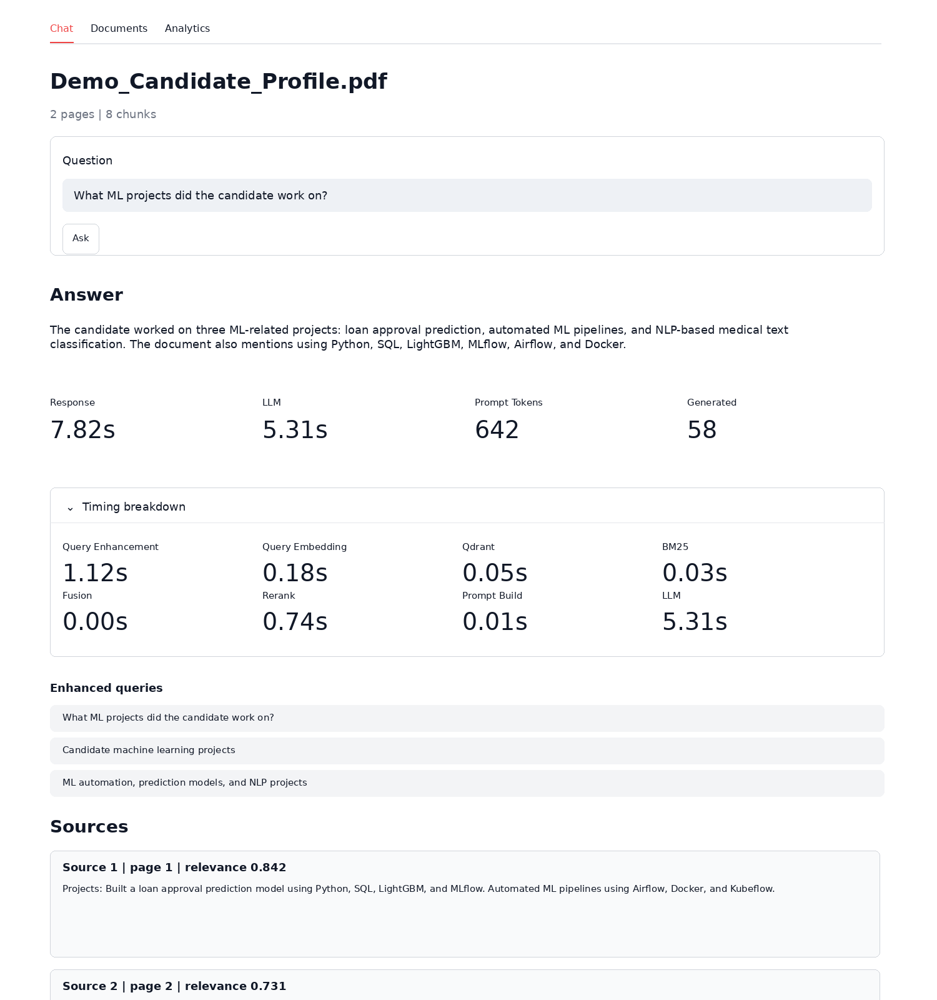
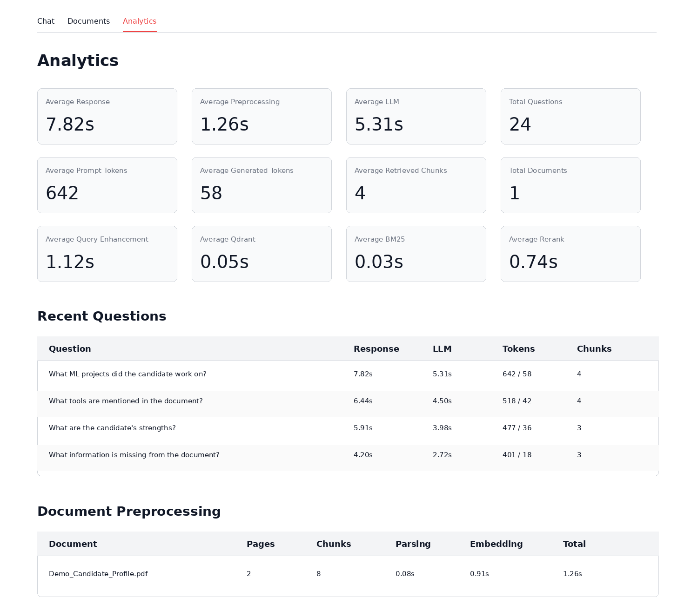

# PDF Chat RAG

Local PDF question-answering application that turns uploaded documents into a searchable knowledge base and answers business questions with cited sources, retrieval diagnostics, and analytics.

This project demonstrates an end-to-end Retrieval-Augmented Generation (RAG) workflow using FastAPI, Streamlit, Qdrant, SentenceTransformers, BM25, CrossEncoder reranking, SQLite analytics, and a local Ollama LLM.

## Business Problem

Teams often store important information in PDFs: candidate profiles, interview notes, policies, reports, technical documentation, contracts, and internal knowledge documents. Finding the right answer manually is slow, especially when users need evidence from the original document.

This application solves that by letting users:

- Upload a PDF.
- Ask natural-language questions.
- Retrieve the most relevant document passages.
- Generate a grounded answer using only the retrieved context.
- Inspect the exact source chunks used for the answer.
- Track latency, token usage, and pipeline performance.

The result is a local, privacy-friendly RAG MVP that can be used to prototype document search, HR screening support, internal knowledge assistants, and PDF-based Q&A workflows.

## Demo

### Chat With a PDF

The chat view shows the selected document, user question, generated answer, timing metrics, enhanced retrieval queries, and cited source chunks.



### RAG Analytics Dashboard

The analytics view tracks response time, preprocessing time, LLM latency, token usage, retrieved chunks, recent questions, and document ingestion metrics.



## Key Capabilities

- PDF upload and ingestion.
- Page-level text extraction with PyMuPDF.
- Dense vector retrieval with Qdrant.
- Sparse keyword retrieval with BM25.
- Query enhancement for stronger search coverage.
- Reciprocal Rank Fusion to combine dense and sparse results.
- CrossEncoder reranking for better final chunk ordering.
- Local answer generation with Ollama.
- Page-level citations and source quotes.
- Chunk inspection for debugging retrieval quality.
- SQLite analytics dashboard for latency and token tracking.
- Fully local Docker-based setup.

## Why This Project Matters

This is more than a basic chatbot. It shows the core engineering pieces behind a production-style RAG system:

- **Retrieval quality:** combines semantic search, keyword search, fusion, and reranking.
- **Grounding:** answers are generated from selected PDF chunks rather than open-ended model memory.
- **Observability:** tracks response time, LLM time, retrieval time, token usage, and ingestion metrics.
- **Local-first design:** runs on a laptop without external LLM APIs or paid cloud services.
- **Debuggability:** exposes enhanced queries, timing breakdowns, chunks, and sources.

## Architecture

```text
Browser
  |
  v
Streamlit frontend :8501
  |
  v
FastAPI backend :8000
  |       |         |
  |       |         +--> Ollama on Windows :11434
  |       |
  |       +--> SQLite metadata, chunks, and analytics
  |
  +--> Qdrant vector database :6333
```

Document ingestion:

```text
PDF upload
  -> PyMuPDF text extraction
  -> text chunking
  -> MiniLM embeddings
  -> Qdrant vector storage
  -> SQLite metadata and chunk storage
```

Question answering:

```text
User question
  -> query enhancement
  -> dense Qdrant retrieval
  -> sparse BM25 retrieval
  -> Reciprocal Rank Fusion
  -> CrossEncoder reranking
  -> top chunks
  -> Ollama answer generation
  -> cited answer + metrics
```

## Retrieval Pipeline

The app uses a hybrid retrieval pipeline optimized for a CPU-only laptop:

1. The original question is enhanced into up to 3 query variants.
2. Each query variant is embedded with `sentence-transformers/all-MiniLM-L6-v2`.
3. Qdrant retrieves dense vector candidates.
4. BM25 retrieves sparse keyword candidates from SQLite chunk text.
5. Reciprocal Rank Fusion merges dense and sparse ranked lists.
6. Duplicate chunks are removed during fusion.
7. The top fused candidates are reranked with `cross-encoder/ms-marco-MiniLM-L-6-v2`.
8. The final top chunks are sent to Ollama as the only answer context.

## Analytics

The application includes a lightweight RAG analytics tracker using SQLite.

Tracked ingestion metrics:

- Number of pages.
- Number of chunks.
- Total preprocessing time.
- PDF parsing time.
- Chunking time.
- Embedding time.
- Qdrant upsert time.

Tracked chat metrics:

- Total response time.
- Query enhancement time.
- Query embedding time.
- Qdrant search time.
- BM25 search time.
- Fusion time.
- Reranking time.
- Prompt build time.
- LLM generation time.
- Prompt tokens.
- Generated tokens.
- Retrieved chunks.
- Average relevance score.

## Tech Stack

| Layer | Technology |
|---|---|
| Frontend | Streamlit |
| Backend API | FastAPI |
| Vector database | Qdrant |
| Metadata and analytics | SQLite |
| PDF parsing | PyMuPDF |
| Embeddings | SentenceTransformers MiniLM |
| Sparse retrieval | BM25 with `rank-bm25` |
| Reranking | CrossEncoder |
| Local LLM | Ollama |
| Deployment | Docker Compose |

## Local Setup on Windows

1. Install Docker Desktop.
2. Install Ollama directly on Windows.
3. Pull the local model:

```powershell
ollama pull qwen2.5:1.5b
```

4. Create your environment file:

```powershell
Copy-Item .env.example .env
```

5. Start the app:

```powershell
docker compose up -d --build
```

6. Open the Streamlit UI:

```text
http://localhost:8501
```

Useful local URLs:

```text
Backend API docs: http://localhost:8000/docs
Qdrant dashboard: http://localhost:6333/dashboard
```

Ollama is intentionally not included in Docker Compose. The backend calls Ollama through `http://host.docker.internal:11434`, allowing containers to reach the Windows host.

## Configuration

Important `.env` settings:

- `DENSE_TOP_K=25` controls Qdrant vector candidates.
- `SPARSE_TOP_K=25` controls BM25 candidates.
- `RRF_K=60` controls Reciprocal Rank Fusion smoothing.
- `RERANK_TOP_N=25` controls how many fused candidates go to the CrossEncoder.
- `FINAL_TOP_K=3` controls how many chunks are sent to Ollama.
- `QUERY_ENHANCEMENT_ENABLED=true` enables enhanced query variants.
- `QUERY_VARIANTS=3` controls the maximum number of query variants.
- `RERANKING_ENABLED=true` enables CrossEncoder reranking.

## API Endpoints

- `GET /health` returns backend health.
- `POST /documents/upload` uploads and ingests a PDF.
- `GET /documents` lists uploaded documents.
- `GET /documents/{document_id}` returns document metadata.
- `GET /documents/{document_id}/chunks` returns stored chunks for one document.
- `POST /documents/{document_id}/chat` answers a question about one document.
- `DELETE /documents/{document_id}` deletes document metadata, vectors, and the uploaded file.
- `GET /analytics/summary` returns aggregate analytics.
- `GET /analytics/chats` returns recent chat metrics.
- `GET /analytics/ingestion` returns recent ingestion metrics.

## Current Limits

- PDF size limit: 20 MB.
- Page limit: 80 pages.
- No OCR yet.
- No table extraction yet.
- Uses a small local model for laptop-friendly inference.
- Query enhancement adds one extra local Ollama call per question.
- CrossEncoder reranking improves quality but adds CPU latency.
- Not intended for confidential production data without authentication and hardening.

## Future Improvements

- OCR for scanned PDFs.
- Multi-document chat.
- Quote highlighting inside the source document.
- Evaluation dataset for answer quality.
- Authentication and role-based access.
- Postgres instead of SQLite for production metadata.
- Langfuse, Prometheus, or OpenTelemetry integration.
- GPU-backed inference for lower latency.
